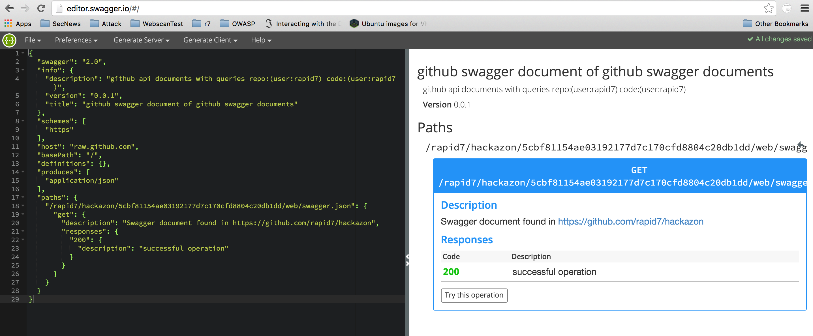

#swagger-github



outputs a swagger 2.0 document referencing swagger documents found via github api search.


installation
------------

```
npm install -g swagger-github
```

usage
-----

rate limited api requests
* authenticated: 30 requests per minute.
* unauthenticated: 10 requests per minute.

```
#unauthenticated
swagger-github
```

```
#authenticated
GITHUB_TOKEN=<your-generated-token> swagger-github
```

```
#specified repos query (default is "user:rapid7")
REPO_QUERY="stars:>10000" swagger-github
```

```
#specified swagger query (default is  "swagger in:path extension:json" )
SWAGGER_QUERY="swagger.json in:path" swagger-github
```

```
#authenticated repo query with default swagger query
GITHUB_TOKEN=1234566789 REPO_QUERY="stars:>5000" swagger-github
```

example
-------

Default run ```swagger-github``` produces

```
{
  "swagger": "2.0",
  "info": {
    "description": "github api documents with queries repo:(user:rapid7) code:(swagger in:path extension:json)",
    "version": "0.0.1",
    "title": "github swagger document of github swagger documents"
  },
  "schemes": [
    "https"
  ],
  "host": "raw.github.com",
  "basePath": "/",
  "definitions": {},
  "produces": [
    "application/json"
  ],
  "paths": {
    "/rapid7/hackazon/5cbf81154ae03192177d7c170cfd8804c20db1dd/web/swagger.json": {
      "get": {
        "description": "Swagger document found in https://github.com/rapid7/hackazon",
        "responses": {
          "200": {
            "description": "successful operation"
          }
        }
      }
    }
  }
}

```


